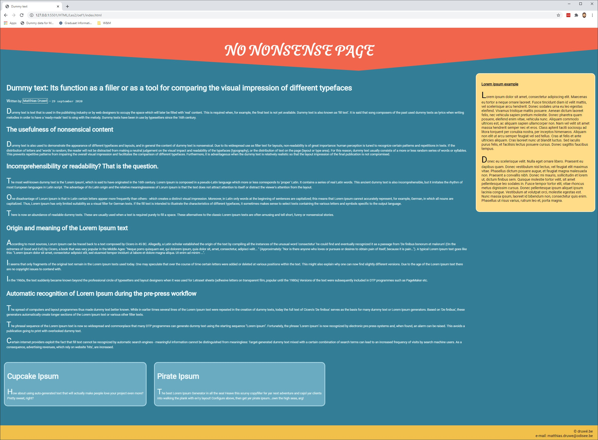

# Oefening

Maak de tekst in de file index.html op met behulp van de "juiste" semantische tags.

De tekst in de index-file bestaat uit 4 losse delen tekst. Zorg ervoor dat de juiste headings gebruikt worden.

## Voorbeeld

Wanneer de tags goed zitten zou je een gelijkaardig resultaat moeten bekomen.

## Extra

Breidt de pagina gerust uit met extra content. Zorg wel dat de semantische tags juist zitten.
